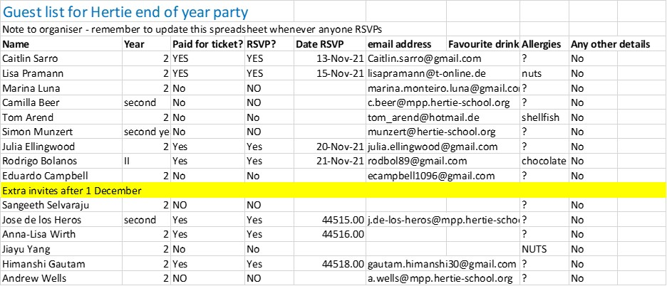

```{r setup, include=FALSE}
knitr::opts_chunk$set(echo = FALSE, message = FALSE, warning = FALSE) 
```

## Why Janitor? `r emo::ji("computer")`

Data scientists, according to interviews and expert estimates, spend from 50 percent to 80 percent of their time mired in this more mundane labor of collecting and preparing unruly digital data, before it can be explored for useful nuggets. - [For Big-Data Scientists, ‘Janitor Work’ Is Key Hurdle to Insight - New York Times, 2014 ](https://www.nytimes.com/2014/08/18/technology/for-big-data-scientists-hurdle-to-insights-is-janitor-work.html) 

As a budding data scientist, do you feel like you spend a lot of time **tidying** data? Renaming columns, deleting unnecessary information, wrangling data into `tidy data` format? If your answer to this question is yes, this session is for you.`r emo::ji("sparkles")`

The janitor package is a great tool and simple to use for cleaning and examining data. Janitor is very user friendly as it was built with beginning and intermediate R users in mind. Advanced R users can already do almost everything that this package does, however with janitor they will save time. 

## Janitor

The janitor package is a R package that has simple functions for examining and cleaning dirty data. While cleaning and exploring data are some of its key functions, janitor also offers some functions to create and format frequency tables. 

The main janitor functions:

* perfectly format data.frame column names
* create and format frequency tables of one, two, or three variables (an improved table() function)
* provide other tools for cleaning and examining data.frames

It is important to notice that janitor is a **tidyverse-oriented package**. In other words, it plays nicely with the %>% pipe and is optimized for cleaning data brought in with the readr and readxl packages.

In this presentation you will learn:

* what we mean by dirty data
* how to save time cleaning data 
* key functions of the janitor package

The presentation will be divided into two parts:

1. Cleaning a dirty dataset
2. Creating and editing table
```{r}
library(tidyverse) # So we have all the other useful tidyverse functions
library(janitor) # the package of the moment
library(readxl) # to load excel
library(lubridate) # for better presentation of dates
library(devtools) #to make the RMD look great
library(usethis)
```

## Section 1: Cleaning a dirty dataset

One of the best features of the janitor package is how it can help you to clean messy data tables, which you receive in excel format or download from the web. Our excel spreadsheet contains fake data about attendees at the 'Hertie end of year party'. It looks like this:


```{r, fig.align='center', echo=F, out.width = "100%"}

```


Let's load the excel file and check how it loads in R.

```{r}
party_raw <- read_excel("party.xlsx")
slice(party_raw)
```
We can see there are several problems with this data:

* The column names are in the third row 
* There are columns which don't have any data in them
* The 'date RSVP' column has a mixed format
* The 'paid for ticket' and 'RSVP' columns are duplicated - suggesting that when someone RSVPs, they have to pay for their ticket anyway.
* And more...

Let's use the **janitor** package to clean the data.

```{r}
party <- party_raw %>% 
  row_to_names(row_number = 2) %>%
  clean_names()
```

Now we have removed the useless first row and made the column names clearer using `clean_names`.

**Exercise**
Using janitor functions you learned in the pre-recorded session, can you

* Delete empty columns
* Delete empty rows
* Remove columns that have a constant value
* Update the date format so that the dates are consistent? (Hint: use the lubridate package)

Solution
```{r}
party <- party %>%
  remove_empty(c("rows", "cols")) %>%
  remove_constant(na.rm = TRUE, quiet = FALSE) %>%
  mutate(date_rsvp_updated = convert_to_date(date_rsvp,
                                             character_fun = lubridate::mdy))

```

## Creating tables

Janitor also offers a version of the table() function from base R, but in a much more powerful form. To demonstrate this, we're going to use a dataset on athletes who won medals at the recent Tokyo 2021 Olympics. This data was downloaded from [Kaggle, here](https://www.kaggle.com/arjunprasadsarkhel/2021-olympics-in-tokyo/version/7)

First we will load the data

```{r}

```

What if we want to know the medal breakdown by country? Janitor uses tidyverse syntax, so we can sort the number of medals in descending order and only view the top 10 countries
```{r}

  
```
